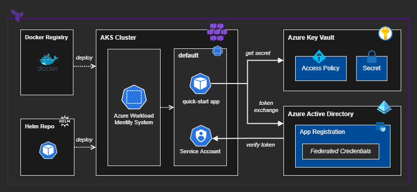

# Azure Workload Identity w/ Terraform

Terraform modules to create an AKS Cluster with active OIDC that integrates with Workload Identity, allowing your pods to connect to Azure resources using Azure AD Application.

This example is a Terraform implementation of the Workload Identity [Quick Start](https://azure.github.io/azure-workload-identity/docs/quick-start.html) guideline.

## Architecture

The overall architecture of the solution and it's main components that are managed by Terraform.



## Project Structure

This project is composed by the following Terraform modules:

- **Azure** - Create the RG, AKS cluster w/oidc, KV, App Reg, Service Principal.
- **Helm** - Install the Azure Workload Identity System objects.
- **Kubernetes** - Create the Service Account and deploy a quick-start workload.

> Modules are isolated for individual `apply` commands, following [this warning](https://registry.terraform.io/providers/hashicorp/kubernetes/latest/docs#stacking-with-managed-kubernetes-cluster-resources) from the Kubernetes provider.

## Deployment Steps

You can deploy this example solution following these steps:

### 1. Pre-Requisites

Check the installation docs in [Managed Azure Kubernetes Service (AKS)](https://azure.github.io/azure-workload-identity/docs/installation/managed-clusters.html#azure-kubernetes-service-aks) and make sure the required feature flags are enabled.


### 2. Project Setup

Create the local variables from the example file:

```bash
# Copy from the template
cp .config/example.local.tfvars .local.tfvars

# Set is as relative to work from the modules root
tfvars='.local.tfvars'
```

You might want to change the `app_name` value to avoid conflict with existing resources. Just make sure that `kv-${app_name}` won't exceed 24 characters, as this is the Key Vault limit.

All other variables are optional and have default values, but you may edit to fit your needs.

### 3. Deploy the Resources

Create the Azure Cloud resources:

```bash
terraform -chdir='azure' init
terraform -chdir='azure' apply -var-file=$tfvars -auto-approve
```

Apply the Helm module:

```bash
terraform -chdir='helm' init
terraform -chdir='helm' apply -var-file=$tfvars -auto-approve
```

Apply the Kubernetes module:

```bash
terraform -chdir='kubernetes' init
terraform -chdir='kubernetes' apply -var-file=$tfvars -auto-approve
```
On your own solutions you might choose to use `yaml` files, but here we are making it everything managed by TF for convenience.

That's it, you can now copy the output `aks_get_credentials_command` variable to test Workload Identity with the `quick-start` container.


### 4. Test with Workload

Connect using `kubectl` and check the response:

```bash
az aks get-credentials -g '<resource-group-name>' -n '<aks-name>'

kubectl logs quick-start
```

You should see the output: `successfully got secret, secret=Hello!`

---

### Clean Up

Delete the resources to avoid unwanted costs:

```bash
terraform -chdir='azure' destroy -var-file=$tfvars -auto-approve
```

[1]: .docs/terraform-aks.drawio.svg